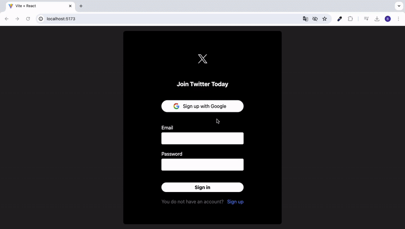

<h1>TWITTER CLONE _firebase_</h1>

Rediscover the Twitter experience with the Clone Twitter app! This innovative app utilizes a Firebase-based database, allowing users to log in seamlessly with either an email or a Google account. With Clone Twitter, you can enjoy the core functionalities of Twitter: post tweets, upload images, edit your tweets, like tweets, and delete tweets when needed. Additionally, the app provides detailed timestamps, so you can easily see the exact date and time when each tweet was posted. If you forget your password, simply use the "Forgot Password" feature to receive an email to reset your password.

<h2> Software Languages </h2>

- HTML

- CSS

- TypeScript

<h2> Libraries </h2>

- React

- React Router 

<h2> Development Tools </h2>

- Vite

<h2> Framework </h2>

- Tailwind CSS

<h2> Database </h2>

- Firebase

<h3> Minor Libraries </h3>

- Flowbite

- Moment

- React Icons

- UUID

- React Toastify

<h2> Screen Gif </h2>

